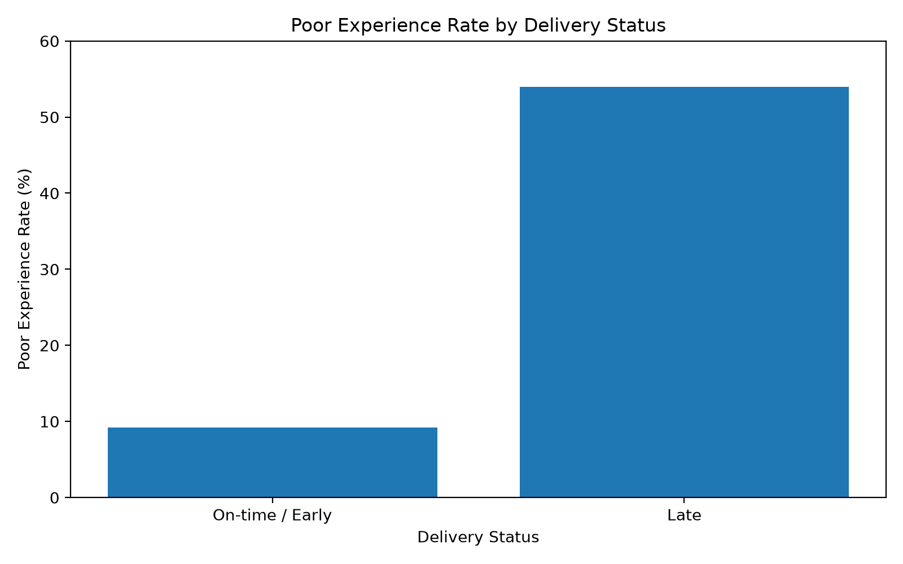
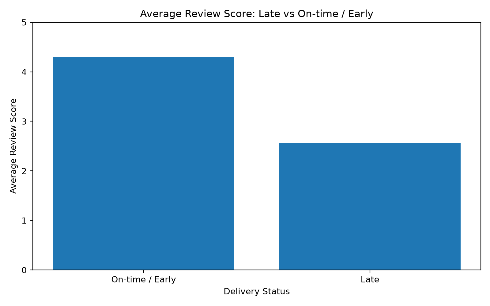
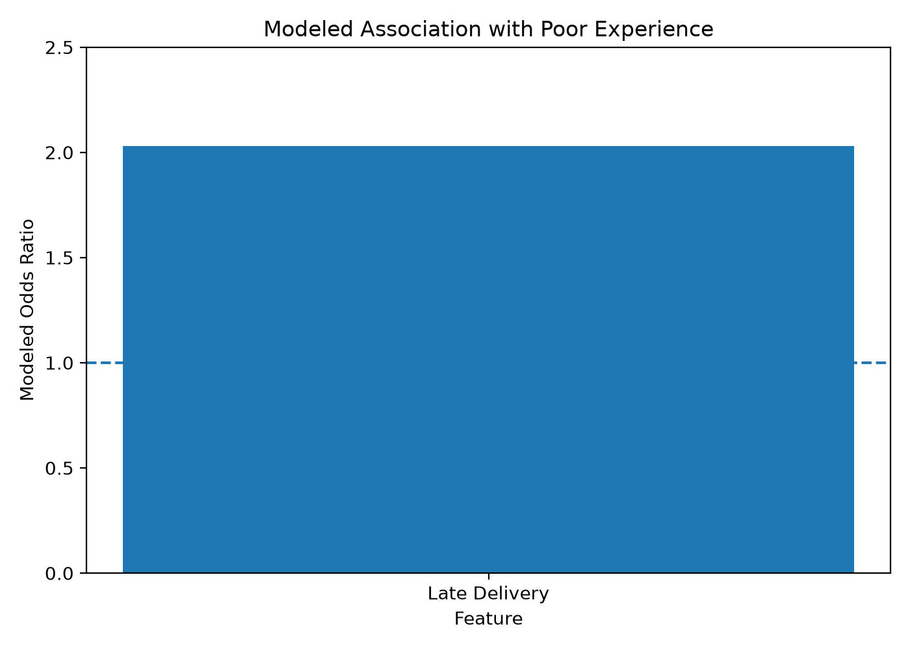
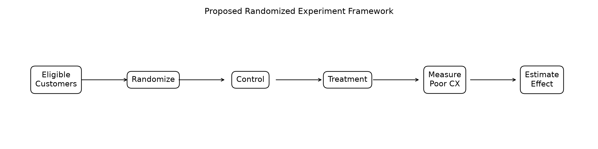

# Customer Experience Root-Cause & Experimentation Analytics

## Overview

An end-to-end customer experience analytics project designed to identify factors associated with poor customer experience, quantify their statistical relationship, and translate the findings into a proposed experimentation strategy and business recommendation.

The project combines:

* SQL analytics
* Customer experience metrics
* Root-cause / driver analysis
* Statistical hypothesis testing
* Multivariate predictive modeling
* Experiment design
* Power analysis
* Synthetic experiment simulation
* Business impact analysis
* Executive-style recommendations

The project uses the **Brazilian E-Commerce Public Dataset by Olist**.

> **Important methodological note:** The Olist dataset is observational. Historical relationships are interpreted as associations, not causal effects. No historical A/B test is claimed. The experiment section represents a proposed randomized experiment and a synthetic simulation.

---

## Key Results

* **95,830 orders** in the final controlled analysis population.
* Baseline poor-experience rate in the controlled population: **12.77%**.
* Late-delivery orders had approximately **5.87× the observed risk** of poor experience compared with on-time/early orders.
* After controlling for order value, seller, and category, late delivery was associated with approximately **2.03× higher modeled odds** of poor experience.
* A proposed randomized experiment requires **8,898 observations** under the stated 15% relative-reduction design assumption.
* The experiment section is a **synthetic simulation**, not a real A/B test.
* The project demonstrates a complete workflow from **SQL analysis → statistical testing → predictive modeling → experiment design → business recommendation**.

---

## Business Problem

Customer experience can be affected by multiple operational factors such as delivery performance, seller behavior, order characteristics, and product categories.

The core business question is:

> **What factors are associated with poor customer experience, and what intervention should the business test to improve it?**

The analysis focuses on:

1. Measuring baseline customer experience.
2. Identifying operational factors associated with poor experience.
3. Quantifying the relationship between delivery performance and review outcomes.
4. Controlling for seller, category, and order-value differences.
5. Designing a statistically valid experiment.
6. Estimating potential business impact under explicit assumptions.
7. Translating analytical findings into a business recommendation.

---

# Project Pipeline

```text
Raw Olist Data
      │
      ▼
Data Validation
      │
      ▼
SQL Data Relationships
      │
      ▼
Customer Experience Metrics
      │
      ├──────────────► Delivery Analysis
      │
      ├──────────────► Category Analysis
      │
      └──────────────► Seller Analysis
                           │
                           ▼
                  Driver / Root-Cause Analysis
                           │
                           ▼
                 Statistical Hypothesis Tests
                           │
                           ▼
                Multivariate Logistic Model
                           │
                           ▼
                    Experiment Design
                           │
                           ▼
                     Power Analysis
                           │
                           ▼
                  Synthetic Simulation
                           │
                           ▼
                  Business Impact Analysis
                           │
                           ▼
                 Business Recommendation
```

---

# Dataset

**Source:** Brazilian E-Commerce Public Dataset by Olist

The analysis uses the following Olist tables:

* Customers
* Orders
* Order Items
* Order Payments
* Order Reviews
* Products
* Sellers
* Geolocation
* Product Category Translation

The raw dataset is intentionally excluded from this repository through `.gitignore`.

---

# Customer Experience Definition

For the analysis, a **poor customer experience** is defined as:

```text
review_score <= 2
```

This converts the customer review score into a business-oriented binary outcome suitable for:

* segmentation
* statistical testing
* predictive modeling
* experiment design
* business impact estimation

---

# Baseline Customer Experience

Across the complete order population:

| Metric               | Result |
| -------------------- | -----: |
| Total orders         | 99,441 |
| Average review score |  4.086 |
| Poor-experience rate | 16.01% |
| Late-delivery rate   |  8.11% |
| Average order value  | 160.83 |

For the final controlled analysis population, after applying the representative seller/category methodology:

| Metric               | Result |
| -------------------- | -----: |
| Analysis orders      | 95,830 |
| Poor-experience rate | 12.77% |
| Late-delivery rate   |  8.00% |

The complete-order baseline and controlled-analysis baseline are reported separately because the controlled analysis applies additional order-level filtering and representative seller/category assignment.

---

# Data Quality & Grain Validation

A key issue discovered during analysis was that the raw review table contains multiple review records for some orders.

Therefore, the project explicitly validates review grain before statistical analysis.

Observed:

* Raw review rows: **99,224**
* Unique reviewed orders: **98,673**
* Additional review rows: **551**

To prevent duplicated review observations from biasing the analysis, the project creates an order-level review representation using the average review score per order.

This is an important analytical safeguard because customer-experience metrics should be evaluated at the appropriate business grain.

---

# Delivery & Customer Experience Analysis

Delivery performance shows a strong observational relationship with customer review outcomes.

Among reviewed orders:

| Delivery Status | Orders | Avg Review | Poor Experience |
| --------------- | -----: | ---------: | --------------: |
| On-time / Early | 88,168 |      4.294 |          10.00% |
| 1–3 days late   |  1,852 |      3.291 |          37.67% |
| 4–7 days late   |  1,748 |      2.106 |          75.03% |
| 8–14 days late  |  1,447 |      1.672 |          87.86% |
| 15+ days late   |  2,615 |      2.856 |          51.99% |
| Unknown         |  2,843 |      1.753 |          84.41% |

The relationship is **nonlinear**, particularly because the 15+ day bucket does not continue the same monotonic pattern.

Therefore, the project avoids claiming that every additional day of delay necessarily produces a continuously increasing customer-experience effect.

---

# Key Visual Findings

## Delivery and Customer Experience



## Review Score Comparison



## Multivariate Modeled Association



## Proposed Experiment Framework



---

# Statistical Analysis

## Welch's t-test

The project compares average review scores between late and on-time/early deliveries.

Results:

* Late-delivery mean: **2.567**
* On-time/early mean: **4.294**
* Difference: **-1.728 review points**
* Welch t-statistic: **-89.38**
* p-value: **< 0.001**
* 95% CI: **[-1.766, -1.690]**
* Cohen's d: **-1.45**

The observed difference is statistically significant.

However:

> This is an observational association and should not be interpreted as proof that late delivery alone caused the lower review scores.

---

# Poor-Experience Association

For the binary poor-experience outcome:

* Late-delivery poor-experience rate: **53.98%**
* On-time/early poor-experience rate: **9.19%**
* Relative risk: **5.87**
* Odds ratio: **11.59**
* Cramer's V: **0.364**
* Chi-square: **12,688.98**
* p-value: **< 0.001**

Interpretation:

> In this observational dataset, late-delivery orders had approximately **5.87× the observed risk** of being classified as poor experience compared with on-time/early orders.

This is an association, not a causal estimate.

---

# Multivariate Driver Modeling

To move beyond a simple two-group comparison, the project builds a multivariate logistic regression model.

## Target

```text
poor_experience = review_score <= 2
```

## Features

* Late delivery
* Log-transformed order value
* Seller
* Product category group

Categorical variables are encoded using one-hot encoding.

The model uses:

* 80/20 stratified train-test split
* StandardScaler
* OneHotEncoder
* L2-regularized Logistic Regression
* Balanced class weights

## Model Results

| Metric                 | Result |
| ---------------------- | -----: |
| Accuracy               |  0.778 |
| ROC-AUC                |  0.727 |
| PR-AUC                 |  0.367 |
| Poor-experience recall |  0.530 |
| Poor-experience F1     |  0.378 |

The model is intended primarily for **analytical interpretation and driver investigation**, rather than production deployment.

## Delivery Effect

The late-delivery coefficient corresponds to a modeled odds ratio of:

```text
Odds Ratio = 2.03
```

Interpretation:

> After controlling for order value, seller, and category in this model, late delivery is associated with approximately **2.03× higher modeled odds** of poor experience.

Again, this is observational and does not establish causality.

---

# Proposed Experiment

The historical dataset cannot prove whether an intervention will improve customer experience.

Therefore, the project converts the observational finding into a **proposed randomized experiment**.

## Proposed Intervention

Test a delivery-risk intervention for eligible orders, such as proactive operational intervention for orders predicted to have elevated delivery risk.

Potential intervention components could include:

* earlier fulfillment escalation
* proactive exception handling
* delivery-risk monitoring
* operational escalation for high-risk orders

The exact operational intervention would need to be validated by the business and fulfillment teams.

---

# Experiment Population

Eligible analysis population:

```text
95,830 orders
```

Observed baseline:

```text
Poor-experience rate = 12.77%
```

The proposed experiment uses:

* Control group
* Treatment group
* Binary poor-experience outcome
* Two-sided significance level
* 80% statistical power

---

# Power Analysis

The design assumes a **15% relative reduction** in poor-experience rate.

## Design Assumptions

| Parameter                  |  Value |
| -------------------------- | -----: |
| Baseline rate              | 12.77% |
| Assumed relative reduction |    15% |
| Expected treatment rate    | 10.86% |
| Alpha                      |   0.05 |
| Statistical power          |   0.80 |
| Required control size      |  4,449 |
| Required treatment size    |  4,449 |
| Total required sample      |  8,898 |

The 15% reduction is a **design assumption**, not an observed historical result.

---

# Synthetic Experiment Simulation

A synthetic randomized experiment is simulated using the calculated sample size.

Simulation output:

| Metric              |                  Result |
| ------------------- | ----------------------: |
| Control rate        |                  12.36% |
| Treatment rate      |                  10.56% |
| Absolute difference | -1.80 percentage points |
| Relative change     |                 -14.55% |
| p-value             |                  0.0078 |

The simulated result is statistically significant under this particular synthetic draw.

> **Important:** This is a simulation, not an actual experiment conducted on customers.

---

# Experiment Disclaimer

**No treatment was actually deployed to customers, and no real randomized experiment was conducted. The treatment effect, business impact, and simulation results are design/synthetic scenarios only.**

The purpose of the experiment section is to demonstrate how an observational business finding can be converted into a statistically structured test plan.

---

# Business Impact

Using the observed eligible population of 95,830 orders and the 15% design assumption:

```text
Baseline poor-experience orders ≈ 12,240

Expected poor-experience orders after intervention ≈ 10,404

Expected reduction ≈ 1,836 orders
```

This represents a **scenario estimate based on the assumed treatment effect**.

It should not be presented as realized business impact.

---

# Volume Sensitivity

The project also evaluates the potential number of poor-experience orders avoided under different order volumes.

| Annual Orders | 10% Reduction | 15% Reduction | 20% Reduction |
| ------------: | ------------: | ------------: | ------------: |
|        10,000 |           128 |           192 |           255 |
|        50,000 |           639 |           958 |         1,277 |
|       100,000 |         1,277 |         1,916 |         2,555 |
|       500,000 |         6,386 |         9,579 |        12,773 |
|     1,000,000 |        12,773 |        19,159 |        25,545 |

These are scenario calculations rather than observed outcomes.

---

# Business Recommendation

The analysis identifies delivery performance as a strong observational signal associated with poor customer experience.

Therefore, the recommended analytical next step is **not to claim causality from historical data**, but to validate the relationship through a controlled experiment.

The proposed decision process is:

```text
Identify high-risk delivery orders
          ↓
Define experiment eligibility
          ↓
Randomly assign eligible orders
          ↓
Control vs Treatment
          ↓
Measure poor-experience rate
          ↓
Estimate treatment effect + confidence interval
          ↓
Check statistical significance
          ↓
Evaluate operational cost
          ↓
Evaluate customer-experience improvement
          ↓
Decide whether to scale
```

A production decision should consider both statistical evidence and operational economics.

---

# Key Analytical Lessons

## 1. Business grain matters

Review duplication can materially distort customer-level metrics. The analysis explicitly validates order-level review grain before modeling.

## 2. Association is not causation

Late delivery is strongly associated with poor experience, but observational data alone cannot establish a causal effect.

## 3. Simple averages are insufficient

The analysis examines delivery buckets, seller effects, category effects, and a multivariate model rather than relying on one correlation.

## 4. Statistical significance is not business impact

A statistically significant treatment effect still needs to be evaluated against implementation cost and operational feasibility.

## 5. Experimentation converts analysis into a decision framework

The project moves from:

```text
"What happened?"
```

to:

```text
"What should we test?"
```

and finally:

```text
"How should we decide whether to scale it?"
```

---

# Repository Structure

```text
customer-experience-root-cause-experimentation/
│
├── .gitignore
├── README.md
├── requirements.txt
│
├── reports/
│   ├── business_recommendation.md
│   │
│   ├── business_impact/
│   │   ├── business_impact_summary.csv
│   │   └── business_impact_scenarios.csv
│   │
│   ├── experiment/
│   │   ├── experiment_population.csv
│   │   └── experiment_simulation_results.csv
│   │
│   ├── model/
│   │   ├── root_cause_feature_effects.csv
│   │   └── root_cause_model_metrics.csv
│   │
│   └── figures/
│       ├── delivery_vs_poor_experience.png
│       ├── review_score_late_vs_ontime.png
│       ├── root_cause_odds_ratios.png
│       └── experiment_framework.png
│
├── sql/
│   ├── 01_data_relationships.sql
│   ├── 02_customer_experience_base.sql
│   ├── 03_delivery_cx_analysis.sql
│   ├── 04_review_grain_validation.sql
│   ├── 05_corrected_delivery_cx.sql
│   ├── 06_statistical_test_data.sql
│   ├── 07_poor_experience_test_data.sql
│   ├── 08_category_root_cause.sql
│   ├── 09_seller_root_cause.sql
│   ├── 10_seller_delivery_control.sql
│   ├── 11_root_cause_model_data.sql
│   └── 12_experiment_design.sql
│
├── src/
│   ├── inspect_dataset.py
│   ├── run_sql.py
│   ├── run_customer_experience_sql.py
│   ├── run_delivery_cx.py
│   ├── run_corrected_delivery_cx.py
│   ├── run_review_validation.py
│   ├── run_statistical_test.py
│   ├── run_poor_experience_test.py
│   ├── run_category_root_cause.py
│   ├── run_seller_root_cause.py
│   ├── run_seller_delivery_control.py
│   ├── run_root_cause_model.py
│   ├── run_experiment_design.py
│   ├── run_experiment_power.py
│   ├── run_experiment_simulation.py
│   ├── run_business_impact.py
│   └── create_project3_figures.py
│
└── tests/
    └── test_project3.py
```

Raw data and generated database files are intentionally excluded from Git.

---

# Reproducibility

Create and activate a virtual environment:

```bash
python -m venv .venv
```

Activate on Windows:

```bat
.venv\Scripts\activate
```

Install dependencies:

```bash
python -m pip install -r requirements.txt
```

Run the test suite:

```bash
python -m pytest -q
```

Expected:

```text
6 passed
```

Generate project figures:

```bash
python src/create_project3_figures.py
```

---

# Tech Stack

## Programming

* Python
* SQL

## Data Analysis

* Pandas
* NumPy
* DuckDB

## Statistics

* SciPy
* Statsmodels

## Machine Learning

* Scikit-learn
* Logistic Regression

## Visualization

* Matplotlib
* Seaborn

## Engineering

* Git
* GitHub
* Pytest

---

# Amazon Data Scientist Skill Mapping

This project intentionally demonstrates capabilities relevant to data-science internship work:

| Amazon DS-style capability                | Demonstrated in project                              |
| ----------------------------------------- | ---------------------------------------------------- |
| Analytical modeling                       | Logistic regression                                  |
| Statistical analysis                      | Welch test, chi-square, effect sizes                 |
| Customer experience analysis              | Review-score and poor-experience metrics             |
| Identify predictors / investigate drivers | Delivery, seller, category and multivariate analysis |
| Business problem solving                  | Delivery/CX investigation                            |
| Experimentation                           | Randomized experiment design                         |
| Prediction / decision modeling            | Logistic regression and intervention targeting       |
| Quantitative decision making              | Power analysis and impact scenarios                  |
| Written recommendations                   | Business recommendation report                       |
| SQL analytics                             | Multi-table SQL analysis                             |
| Automation / reproducibility              | Python runners + tests                               |
| Business communication                    | Executive-style recommendation                       |

---

# Limitations

1. The dataset is observational.
2. Historical associations cannot establish causality.
3. Seller/category assignment uses a representative order-level methodology for analysis.
4. The experiment has not actually been conducted.
5. The 15% treatment effect is a design assumption.
6. The experiment result is a synthetic simulation.
7. Business impact estimates depend on the assumed treatment effect.
8. The project does not claim production deployment.
9. The proposed intervention has not been operationally validated.
10. The statistical model is intended for analytical interpretation rather than production deployment.

---

# Final Takeaway

This project demonstrates an end-to-end analytical workflow:

```text
SQL
 ↓
Customer Experience Metrics
 ↓
Driver / Root-Cause Analysis
 ↓
Statistical Testing
 ↓
Multivariate Modeling
 ↓
Experiment Design
 ↓
Power Analysis
 ↓
Synthetic Simulation
 ↓
Business Impact
 ↓
Recommendation
```

The central analytical lesson is:

> **Use observational data to identify and quantify signals, but use controlled experimentation to validate whether an intervention actually improves customer outcomes.**
